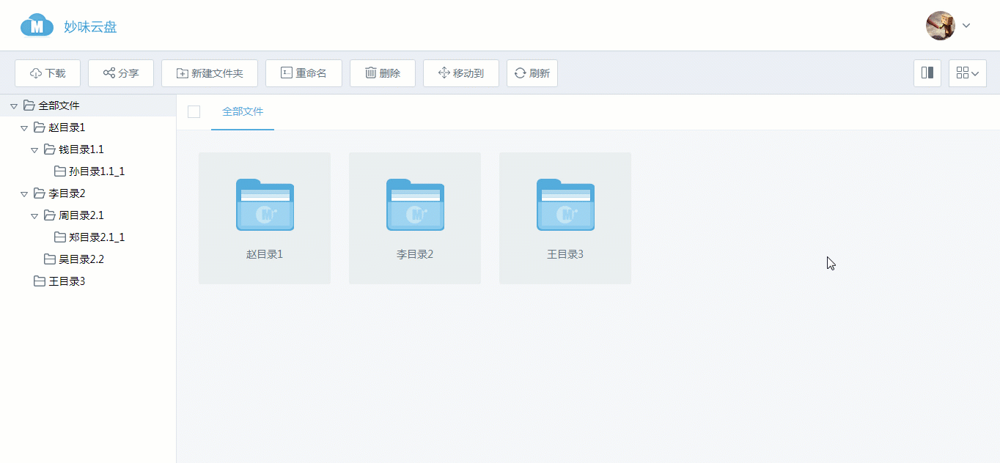

# WEB 前端奥秘探索之旅 - 百度网盘文件夹框选功能



## 案例说明：
使用原生 JS 完成桌面操作级应用，对于原生 JS 的掌握情况而言，是一个较为全面的综合型案例。本次课从事件（event）相关的功能入手，给大家带来详细的分享。

## 案例相关知识点学习

- 原生DOM操作 [查看详情](https://study.miaov.com/study/show/chapter/69)
- 原生Event事件 [查看详情](https://study.miaov.com/study/show/chapter/81)
- ES6相关语法 [查看详情](https://study.miaov.com/study/show/chapter/151)

## 案例思路流程

### 页面基本结构及样式

html:

```
	<button type="button" id="createBtn">新建文件夹</button>
	<label><input type="checkbox" id="checkedAll"> 全选</label>
	<!-- #box 用来存放 文件夹 -->
	<div id="box">
		<!-- file 文件 基本结构 -->
		<!-- fileActive 文件夹选中之后的样式 -->
		<!-- checked 复选框选中之后的样式 -->
		<!-- <div class="file fileActive">
			
			<span>新建文件夹</span>
			<i class="checked"></i>
		</div> -->
	</div>
```

css: 
```
	#box {
		border: 1px solid #000;
		height: 400px;
		overflow: auto;
	}	
	.file {
		position: relative;
		float: left;
		padding: 20px;
		margin: 10px;
		width: 80px;
		border: 1px solid transparent;
		background: #f1f1f1;
	}
	.fileActive {
		border-color: #000;
		background: #fff;
	}
	.file span {
		display: block;
		font: 14px/30px "宋体";
		text-align: center;
	}
	.file i {
		display: none;
		position: absolute;
		left: 1px;
		top: 1px;
		border: 1px solid #000;
		width: 16px;
		height: 16px;
	}
	.checked {
		background: url('img/checked.png');
	}
	.fileActive i {
		display: block;
	}
	.selection {
		position: fixed;
		border: 1px solid #0767dd;
		background: rgba(122, 179, 250, .2)
	}
```

### 创建文件夹

点击 createBtn 时，创建一个新的 .file 放入 #box 中

```
	createBtn.onclick = function(){
		let file = document.createElement("div");
		file.className = "file";
		file.innerHTML = `
			
			<span>新建文件夹</span>
			<i></i>
		`; 
		box.appendChild(file);
	};
``` 

### 文件的鼠标移入移出及选中操作

文件本身是动态创建的，所以在页面加载完成之后去添加事件的话页面上并没有相关元素，但是在文件创建之后在添加事件的话，就需要每次创建完都添加一次事件，为了提高程序的性能，这里我们使用事件代理，把事件统一代理在box上处理

- 鼠标移入处理: 在鼠标移入之后，判断如果是 .file 就直接 改变 .file 的样式，如果 .file 的子级 就先找到父级 .file 然后再改变样式

```
	box.addEventListener('mouseover', function(e) {
		let file = null;
		//判断这个元素上是否有添加这个 classs
		if(e.target.classList.contains("file")){
			file  =	e.target;
		} else if(e.target.parentNode.classList.contains("file")){
			file  =	e.target.parentNode;
		} 
		if(file){
			file.classList.add("fileActive");
		}
	});
```

- 点击改变选中状态: 点击时判断是否点击的是 i 标签(模拟的复选框) 是的话，就切换选中状态

```
	box.addEventListener('click', function(e) {
		if(e.target.tagName == "I"){
			e.target.classList.toggle("checked");		
		}
	});
```

- 鼠标移出：跟鼠标移入一样先找到 .file ，然后找到 .file 下的复选框，判断复选框是否选中，没有选中时，还原 .file 样式

```
	box.addEventListener('mouseout', function(e) {
		let file = null;
		if(e.target.classList.contains("file")){
			file  =	e.target;
		} else if(e.target.parentNode.classList.contains("file")){
			file  =	e.target.parentNode;
		} 
		if(file){
			let checked = file.querySelector('i');
			if(!checked.classList.contains("checked")){
				file.classList.remove("fileActive")
			}
		}
	});
``` 

### 文件的全选和全不选

- 全选复选框的状态发生改变时，根据复选框状态选中或不选中文件

```
	checkedAll.onchange = function(){
		let files = document.querySelectorAll('.file');
		files.forEach(function(item){
			if(checkedAll.checked){
				let checked = item.querySelector('i');
				item.classList.add("fileActive");
				checked.classList.add("checked");	
			} else {
				let checked = item.querySelector('i');
				item.classList.remove("fileActive");
				checked.classList.remove("checked");	
			}
		});
	};
``` 

- 创建判断是否全选的的函数，在 .file 的 checked 状态改变时，调用这个函数，判断当前是否全选

```
	function setCheckedAll(){
		let filesChecked = document.querySelectorAll('.file>i');
		for(let i = 0; i < filesChecked.length; i++){
			if(!filesChecked[i].classList.contains("checked")){
				checkedAll.checked = false;
				return ;
			}
		}
		checkedAll.checked = true;
	}
```

- 每次创建文件时，肯定不在是全选了，所以在创建文件后，取消全选状态

```
	checkedAll.checked = false;
```


### 文件夹框选操作

- 鼠标按下时，创建 selection，鼠标移动时改变 selection 大小，鼠标抬起时删除 selection

```
	document.onmousedown = function(e){
		let selection = document.createElement("div");
		let startClient = {
			x: e.clientX,
			y: e.clientY
		};
		selection.className = "selection";
		document.body.appendChild(selection);
		document.onmousemove = function(e){
			let nowClient = {
				x: e.clientX,
				y: e.clientY
			}; 
			selection.style.width = Math.abs(nowClient.x - startClient.x) + "px";
			selection.style.height = Math.abs(nowClient.y - startClient.y) + "px";
			selection.style.left = Math.min(nowClient.x, startClient.x) + "px";
			selection.style.top = Math.min(nowClient.y, startClient.y) + "px";
		}
		document.onmouseup = function(){
			document.body.removeChild(selection);
			document.onmousemove = null;
			document.onmouseup = null;
		}  
		return false;
	}

```

- 碰撞检测：获取两个元素的可视区坐标，对比坐标，排除所有不可能碰撞的情况剩下的就是碰撞

```
function isCollision(el,el2){
		let elRect = el.getBoundingClientRect();
		let elRect2 = el2.getBoundingClientRect();
		if(elRect.top > elRect2.bottom
		||elRect2.top > elRect.bottom
		||elRect2.left > elRect.right
		||elRect.left > elRect2.right){
			return false;
		}
		return true;
	}
```

- 鼠标在移动的时候，找到所有 file 依次和 selection 进行碰撞检测，如果碰撞就添加选中状态,否则取消选中状态，然后调用 `setCheckedAll()` 方法判断是否全选

```
	files.forEach(function(item){
		let checked = item.querySelector('i');
		if(isCollision(item,selection)){
			item.classList.add("fileActive");
			checked.classList.add("checked");
		} else {
			item.classList.remove("fileActive");
			checked.classList.remove("checked");
		}
		setCheckedAll();
	});
```

## 总结

按照上边步骤我们就可以把网盘的这些基本功能给实现出来，当然在这里边有些点我们可以把它总结出来，也都是常用的一些思路或处理方式

- 事件委托的使用，事件委托可以极大的提高我们的代码性能，尤其是在一些需要频繁更新的视图上, 事件委托不只可以提高性能，也可以精简我们的代码逻辑

- 碰撞检测的思路，碰撞检测这里我们使用了一种排除思路，排除了所有不可能之后，唯一剩余的就碰撞的情况

- 拖拽的思路，用当前位置 - 初始位置得到手指移动距离，另外拖拽在 PC 端最好加给最顶层，否则滑动过快，容易甩掉元素

## 扩展

这里我们只是实现了云盘最基本的一些功能，云盘本身还有很多功能在里边，比如文件夹的展开，以及文件夹的树形菜单，文件夹位置移动等功能，大家可以自己尝试一下，在官网中我们也有具体的教程[具体访问](https://study.miaov.com/study/show/chapter/17)，大家遇到了什么问题，也欢迎来和我们讨论;

